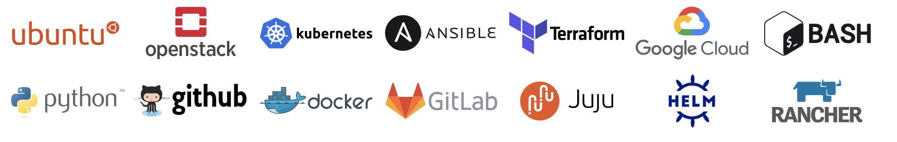

# Intro

---

Welcome! I’m Muhammad Ahmad, a Senior Cloud & DevOps Engineer with deep experience in **cloud-native infrastructure**, **automation**, and **CI/CD pipelines**.  

I help teams modernize their platforms by designing and deploying **secure, highly available, and cost-efficient environments**—from infrastructure as code to end-to-end delivery.

Whether it’s accelerating digital transformation, implementing robust security practices, or streamlining operations, I bring a practical, results-driven approach to every project.

---

### Explore My Work
Discover more about my background and projects through the sections below:

[Skills](skills.md){ .md-button } [Career](career/index.md){ .md-button }  [Contact](contact.md){ .md-button }
