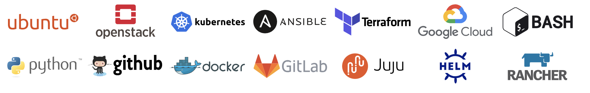

# From Code to Cloud: Engineering Tomorrow's Infrastructure

  
  
  

    
  

---

  
  <h2 style="font-size: 1.4em; color: var(--content-text-primary); margin-bottom: 1.5rem; font-weight: 300; line-height: 1.6;">
    <strong style="color: var(--content-accent);">What if</strong> infrastructure could adapt intelligently? 
    <strong style="color: var(--content-accent);">What if</strong> deployments were truly seamless and reliable?
  </h2>
  
  

    I'm <strong style="color: var(--content-accent); font-size: 1.1em;">Muhammad Ahmad</strong>, and I turn these concepts into <em style="color: var(--content-text-primary);">production reality</em>.
  

  

## **Engineering Excellence in Practice**

Where others see servers and scripts, I see **opportunities for transformation**. Every cloud architecture I design, every pipeline I build, every automation I implement represents a commitment to operational excellence—converting complex manual processes into elegant, resilient systems.

> *"In an era where reliability defines competitive advantage and agility determines market success, I architect solutions that don't just perform—they continuously improve."*

## **Core Competency** 
Transforming intricate technical challenges into **elegant, scalable solutions** that teams confidently rely on.

---

## **Professional Differentiators**

🏗️ **Infrastructure Architecture Expert** → Fluent in Kubernetes, Docker, and GCP—specializing in translating business requirements into robust, production-grade technical solutions.

☁️ **Private Cloud Architecture Specialist** → Deep expertise in designing and deploying enterprise-grade private cloud infrastructure with **OpenStack**, **OpenShift**, **Kubernetes**, and **Ceph** storage solutions—delivering on-premises cloud capabilities with public cloud agility.

🔮 **Automation Specialist** → Beyond traditional CI/CD pipelines, I engineer **intelligent deployment ecosystems** with built-in optimization and self-healing capabilities.

🛡️ **Security-First Engineering** → Every architectural decision, configuration, and deployment integrates security as a foundational principle, ensuring compliance and resilience from the ground up.

💰 **Cost Optimization Strategist** → Demonstrated success in reducing operational expenses by **hundreds of thousands** through efficient, scalable architectures that align with business growth.

🎯 **Technology-Agnostic Problem Solver** → I evaluate and select the **optimal technology stack** for each unique challenge, leveraging both emerging technologies and proven solutions. My diverse experience demonstrates consistent adaptability across platforms and tools.

---

## **Strategic Approach**

Most engineers address immediate challenges. I architect solutions for **long-term sustainability and growth**.

Through predictive resource allocation, comprehensive observability, and resilient system design, I build infrastructure that anticipates requirements, prevents failures, and maintains optimal performance autonomously.

---

## 🌟 **Let's Build Something Exceptional**

Whether you're modernizing legacy infrastructure, streamlining deployment workflows, or planning truly scalable cloud architecture—I bring proven expertise and innovative solutions.

  <h3 style="margin-bottom: 1rem; color: var(--content-text-primary);">🔥 Explore My Professional Portfolio</h3>

  <a href="/skills/" class="md-button">🛠️ Technical Expertise</a>
  <a href="/career/" class="md-button">🚀 Professional Experience</a>
  <a href="/blog/" class="md-button">📚 Technical Articles</a>
  <a href="/contact/" class="md-button">📡 Get In Touch</a>

---

  <em>"The best time to invest in infrastructure was at the start. The second-best time is now. 
  The right time to modernize your cloud operations? <strong>Today.</strong>"</em>

